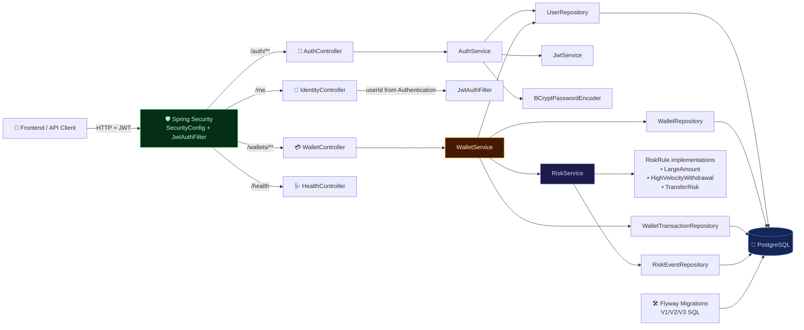

# Digital Wallet


## Quick Start

### 1) Start PostgreSQL

```bash
docker compose up -d db
```

### 2) Start backend

```bash
cd backend
mvn spring-boot:run
# if 8080 is busy:
# mvn spring-boot:run -Dspring-boot.run.arguments="--server.port=8081"
```

Backend API: `http://localhost:8080`

### 3) Start frontend demo

In a new terminal from repo root:

```bash
python3 -m http.server 4173 -d frontend
```

Open `http://localhost:4173`

## Troubleshooting

- If `cd /workspace/Digital-Wallet` fails on your local machine, use your **actual local path** to this repository.
- If `python` command is missing, use `python3`.
- If Maven cannot download dependencies, verify network/proxy and Maven Central access.
- If you run backend on another port (e.g. 8081), set the frontend API Base URL in the UI before login.
- If you open `http://localhost:4173/auth/login` or `/auth/register` in browser, that hits the static frontend server. Use frontend UI or call backend API base URL for auth endpoints.

## Backend Architecture Diagram



### Backend flow at a glance

- **Auth path**: `POST /auth/register` and `POST /auth/login` are public, handled by `AuthController` + `AuthService`, and issue JWTs via `JwtService`.
- **Protected path**: all wallet operations (`create/list/deposit/withdraw/transfer/history`) require JWT, are handled by `WalletController`, and execute transactional logic in `WalletService`.
- **Risk scoring**: each money movement is assessed by `RiskService` using pluggable `RiskRule` components and persisted as `risk_events`.
- **Persistence**: all repositories store domain data in PostgreSQL, with schema managed by Flyway migrations.
