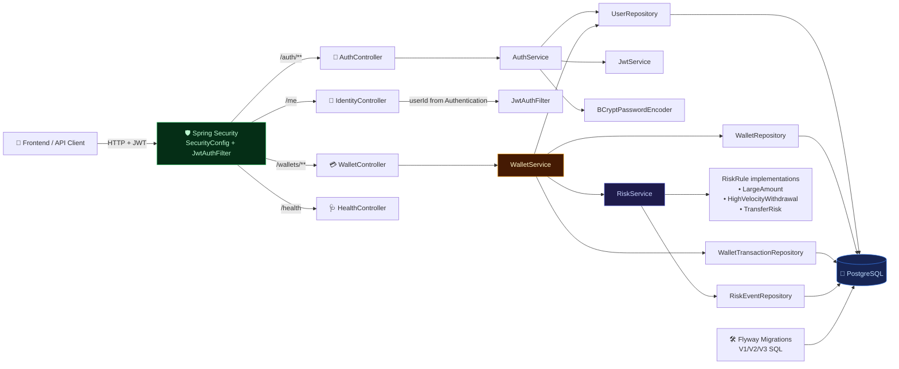

# Digital Wallet
## Backend Architecture Diagram


```mermaid
graph LR
    Client["👤 Frontend / API Client"] -->|"HTTP + JWT"| Security["🛡️ Spring Security\nSecurityConfig + JwtAuthFilter"]

    Security -->|"/auth/**"| AuthController["🔐 AuthController"]
    Security -->|"/wallets/**"| WalletController["💳 WalletController"]
    Security -->|"/me"| IdentityController["🙋 IdentityController"]
    Security -->|"/health"| HealthController["🩺 HealthController"]

    AuthController --> AuthService["AuthService"]
    AuthService --> UserRepo["UserRepository"]
    AuthService --> JwtService["JwtService"]
    AuthService --> PasswordEncoder["BCryptPasswordEncoder"]

    IdentityController -->|"userId from Authentication"| JwtAuthFilter["JwtAuthFilter"]

    WalletController --> WalletService["WalletService"]
    WalletService --> WalletRepo["WalletRepository"]
    WalletService --> TxRepo["WalletTransactionRepository"]
    WalletService --> UserRepo
    WalletService --> RiskService["RiskService"]

    RiskService --> RiskRules["RiskRule implementations\n• LargeAmount\n• HighVelocityWithdrawal\n• TransferRisk"]
    RiskService --> RiskRepo["RiskEventRepository"]

    UserRepo --> Postgres[("🐘 PostgreSQL")]
    WalletRepo --> Postgres
    TxRepo --> Postgres
    RiskRepo --> Postgres

    Flyway["🛠️ Flyway Migrations\nV1/V2/V3 SQL"] --> Postgres

    style Security fill:#052e16,stroke:#4ade80,color:#bbf7d0
    style WalletService fill:#451a03,stroke:#f59e0b,color:#fef3c7
    style RiskService fill:#1e1b4b,stroke:#818cf8,color:#c7d2fe
    style Postgres fill:#172554,stroke:#3b82f6,color:#bfdbfe
```


## Quick Start

### Deploy Phase 01 with Docker Compose (recommended)

```bash
git checkout cursor/phase-01-money-correctness-e892
cp .env.example .env   # edit APP_JWT_SECRET / POSTGRES_PASSWORD for shared envs
docker compose up --build -d
./scripts/smoke-test.sh
```

- API: `http://localhost:8080` (`/health`, `/ready`)
- Frontend demo: `http://localhost:4173`
- Postgres host port: `5433`

Full steps, env vars, tear-down, Railway free/trial notes, and limitations: project store doc `docs/phase-01-deployment.md` (also summarized in PR #18).

### Alternative: start PostgreSQL only, run API with Maven

```bash
docker compose up -d db
```

```bash
cd backend
mvn spring-boot:run
# if 8080 is busy:
# mvn spring-boot:run -Dspring-boot.run.arguments="--server.port=8081"
```

Backend API: `http://localhost:8080`

### Start frontend demo (without Compose frontend service)

In a new terminal from repo root:

```bash
python3 -m http.server 4173 -d frontend
```

Open `http://localhost:4173`

## Troubleshooting

- If `cd /workspace/Digital-Wallet` fails on your local machine, use your **actual local path** to this repository.
- If `python` command is missing, use `python3`.
- If Maven cannot download dependencies, verify network/proxy and Maven Central access.
- If you run backend on another port (e.g. 8081), set the frontend API Base URL in the UI before login.
- If you open `http://localhost:4173/auth/login` or `/auth/register` in browser, that hits the static frontend server. Use frontend UI or call backend API base URL for auth endpoints.


### Backend flow at a glance

- **Auth path**: `POST /auth/register` and `POST /auth/login` are public, handled by `AuthController` + `AuthService`, and issue JWTs via `JwtService`.
- **Protected path**: all wallet operations (`create/list/deposit/withdraw/transfer/history`) require JWT, are handled by `WalletController`, and execute transactional logic in `WalletService`.
- **Risk scoring**: each money movement is assessed by `RiskService` using pluggable `RiskRule` components and persisted as `risk_events`.
- **Persistence**: all repositories store domain data in PostgreSQL, with schema managed by Flyway migrations.

## Money correctness (Phase 01)

Wallets keep a cached `balance`, but completed money movements also write immutable double-entry `ledger_entries` (debits always equal credits). User-facing `transactions` move through `PENDING → COMPLETED|FAILED`. Amounts are integer **minor units** (`BIGINT` / `long` cents) — never floating point and no longer DECIMAL/`BigDecimal` on the ledger path. API `amount` / `balance` fields are cents. Database checks reject negative balances and non-positive amounts; terminal rows cannot be rewritten (compensate with a new opposite movement instead). Reconciliation stays service/test-only for now (no admin HTTP endpoint yet).

